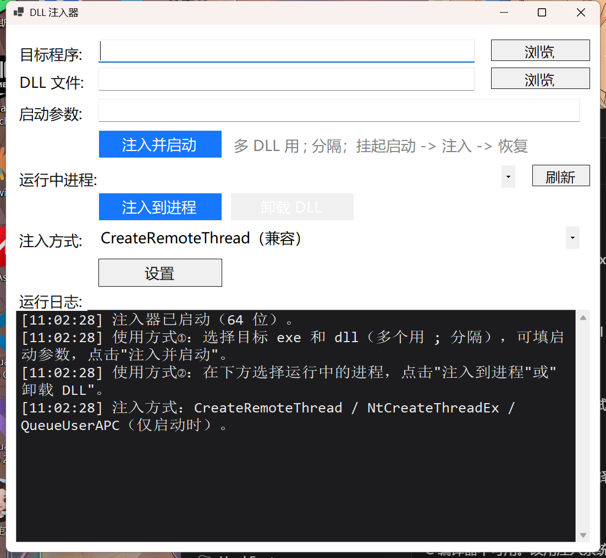

# DLL 注入器 (DLL Injector)

[](https://github.com/isTurn/DllInjectorTest/releases)
[](https://github.com/isTurn/DllInjectorTest/actions)
[](LICENSE)
[](https://github.com/isTurn/DllInjectorTest)
[](https://dotnet.microsoft.com/)
[]()

一个带图形界面的 Windows 工具：选择目标 exe 和要注入的 dll，点击「注入并启动」，工具会以**挂起方式启动目标程序 → 把 DLL 注入进去 → 恢复运行**；也可以**向运行中的进程直接注入**，或**卸载已注入的 DLL**。支持 **x64 / x86** 双架构。

## 界面预览



## 功能特性

- **图形界面**：直观的 WinForms 界面，支持直接把文件拖进输入框
- **启动时注入**：以挂起方式启动目标程序 → 注入 DLL → 恢复运行
- **注入到运行中进程**：点击「刷新」枚举当前进程（名称 + PID），选中后一键注入（OpenProcess + CreateRemoteThread）
- **卸载已注入 DLL**：从目标进程远程调用 FreeLibrary，实现注入 / 卸载闭环
- **记忆上次选择**：自动记住最近一次注入的 exe/dll，下次启动直接带出（配置文件 `DllInjector.config`）
- **命令行模式**：`-inject <exe> <dll>`、`-injectpid <pid> <dll>`、`-eject <pid> <dll名>`，便于脚本自动化，退出码明确区分成败
- **位数自动校验**：位数不匹配时拦截并给出清晰提示，避免目标程序白屏/崩溃
- **完整日志**：界面日志 + 日志文件（`inject_log.txt`）双通道记录每一步结果
- **支持中文路径**：DLL 路径以 UTF-16 写入远程进程，兼容中文目录/文件名
- **自包含单文件**：免安装 .NET 运行时，双击即用（体积较大属正常）

## 快速开始

### 下载

从 [Releases](https://github.com/isTurn/DllInjectorTest/releases) 下载对应版本：

| 文件 | 适用目标 |
| --- | --- |
| `DllInjector-x64.exe` | 64 位目标程序 |
| `DllInjector-x86.exe` | 32 位目标程序 |

> 提示：文件选择对话框默认定位在**注入器 EXE 所在文件夹**。建议把目标 exe 和 dll 与注入器放在同一目录，选择起来更方便。

### 图形界面使用

**方式一：启动时注入**

1. 打开注入器（选择与目标程序同位数 的版本）；
2. 「目标程序」→「浏览...」选择要启动的 exe（也可直接把文件拖进输入框）；
3. 「DLL 文件」→「浏览...」选择要注入的 dll；
4. 点击「注入并启动」，下方日志实时显示每一步结果。

**方式二：注入到运行中进程 / 卸载**

1. 在「运行中进程」右侧点击「刷新」，下拉框列出当前所有进程（名称 + PID）；
2. 下拉选择目标进程；
3. 点击「注入到进程」向它注入当前 DLL 输入框中的文件；
4. 或点击「卸载 DLL」把该进程中已加载的 DLL（以输入框文件名为准）卸载掉。

> 注：注入其它进程（尤其以管理员/其它用户运行的进程）可能提示权限不足，此时请以管理员身份运行注入器。

### 命令行模式（自动化 / 脚本）

```
DllInjector-x64.exe -inject <exe路径> <dll路径>       # 启动目标程序并注入
DllInjector-x64.exe -injectpid <pid> <dll路径>        # 向运行中的进程注入
DllInjector-x64.exe -eject <pid> <dll文件名>          # 从运行中的进程卸载 DLL
```

- 退出码：`0` = 成功，`1` = 失败
- 详细日志写入同目录下 `inject_log.txt`

## 注入原理

### 启动时注入

```
CreateProcess(CREATE_SUSPENDED)
      │  以挂起方式启动目标进程（不执行入口）
      ▼
VirtualAllocEx + WriteProcessMemory
      │  在目标进程内分配内存，写入 DLL 绝对路径（UTF-16，支持中文）
      ▼
CreateRemoteThread(LoadLibraryW)
      │  在目标进程内以远程线程调用 LoadLibraryW，加载 DLL（触发 DllMain）
      ▼
WaitForSingleObject(15s)
      │  等待 DLL 的 DllMain 初始化完成
      ▼
ResumeThread
      │  恢复目标进程主线程，程序正常运行
      ▼
  注入完成
```

### 注入到运行中进程 / 卸载

```
OpenProcess(PROCESS_ACCESS_FOR_INJECT)          OpenProcess(...)
      │  打开已运行的目标进程                      │
      ▼                                            ▼
VirtualAllocEx + WriteProcessMemory          枚举目标进程模块列表
      │  写入 DLL 绝对路径                          │  拿到完整（64 位）模块基址
      ▼                                            ▼
CreateRemoteThread(LoadLibraryW)            CreateRemoteThread(FreeLibrary)
      │  远程加载 DLL，触发 DllMain                  │  远程卸载 DLL
      ▼                                            ▼
  注入完成                                       卸载完成
```

> 说明：64 位进程中模块句柄是 64 位值，而远程线程退出码只有 32 位，直接把退出码当句柄传给 `FreeLibrary` 会导致卸载失败；本工具改为在注入器侧枚举目标进程模块取得完整基址，因此 x64 / x86 卸载均可靠。

## 从源码构建

需要 [.NET 8 SDK](https://dotnet.microsoft.com/)。

```bat
build.bat
```

输出：

| 产物 | 架构 |
| --- | --- |
| `out\x64\DllInjector.exe` | 64 位 |
| `out\x86\DllInjector.exe` | 32 位 |

> 也可以直接使用仓库内置的 [GitHub Actions](.github/workflows/build.yml)：打 `v*` 标签即可自动构建并发布 Release。

## 目录结构

```
DllInjectorTest/
├── .github/
│   ├── workflows/build.yml     # CI：自动构建 x64/x86，打标签时自动发 Release
│   ├── ISSUE_TEMPLATE/          # Issue 模板
│   └── PULL_REQUEST_TEMPLATE.md # PR 模板
├── DllInjector/                # 注入器源码（C# WinForms）
│   ├── Program.cs              # 入口 + 注入核心 + 命令行模式
│   └── DllInjector.csproj
├── test/
│   ├── TestDll/                # 自测用注入 DLL 源码（DllMain 写标记文件验证）
│   └── TestTarget/             # 自测用目标程序源码
├── screenshot.png              # 界面截图
├── build.bat                   # 一键构建脚本（x64 + x86）
├── CHANGELOG.md
├── CONTRIBUTING.md
├── SECURITY.md
├── .gitignore
└── README.md
```

## 注意事项

- **位数必须一致**：DLL 必须与目标程序同为 32 位或 64 位，否则会拒绝注入；
- **仅支持原生 DLL**：需为含 `DllMain` 的 C/C++ 编译产物，托管 .NET DLL 无法以此方式执行代码；
- **杀毒软件可能告警**：`CreateRemoteThread` 注入是常见注入手法，部分杀软会报毒；
- **请合法使用**：仅对你有权操作的软件使用（如插件、MOD、调试、内部工具等场景），详见 [SECURITY.md](SECURITY.md)。

## License

[MIT](LICENSE) © 2026 [isTurn](https://github.com/isTurn)
